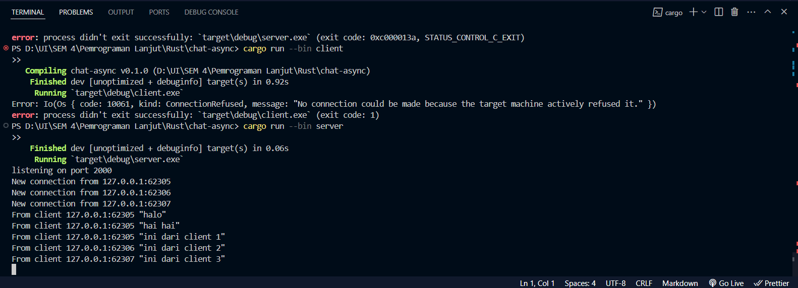
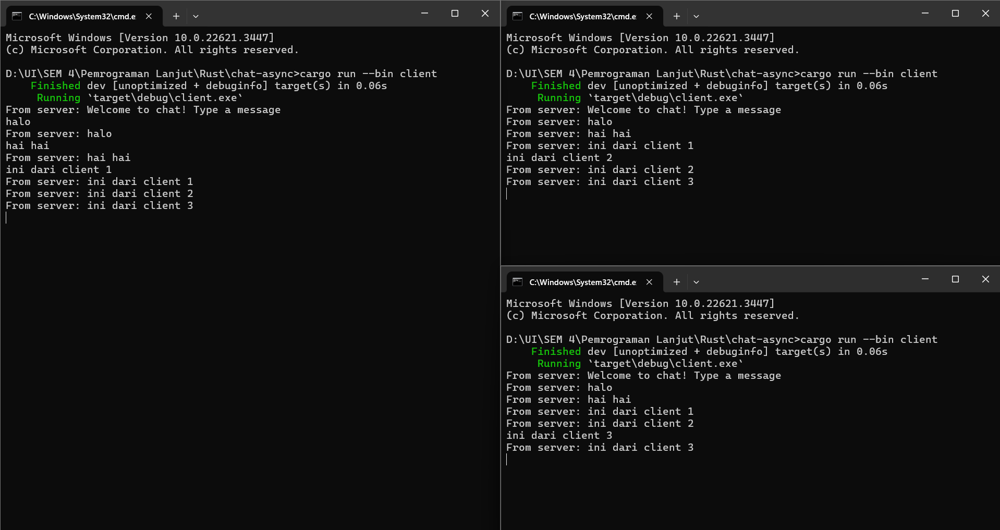
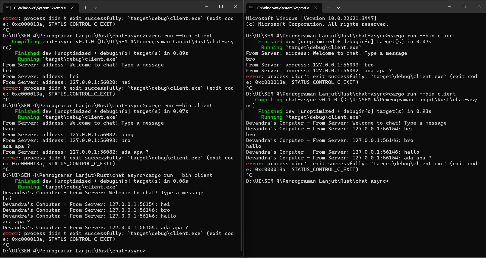

# 2.1. Original code of broadcast chat

<h3>Server Terminal</h3>

<h3>Three Client Terminal</h3>

cara menjalankannya adalah membuat 4 terminal berbeda, lalu jalankan "cargo run --bin server" pada salah satu terminal dan jalankan "cargo run --bin client" pada tiga terminal lainnya. Jika dijalankan keempatnya, kita bisa mengirim pesan dari salah satu client, lalu pesan tersebut dapat terlihat dari server dan dua client lainnya. Namun pesan yang diterima pada client masih bertulisan from server, jadi tidak diketahui siapa yang menuliskan pesan tersebut.

# 2.2. Modifying the websocket port

Yang perlu dimodifikasi dari client adalah url pada clientbuilder, lalu yang dimodifikasi dari server adalah url dari listenernya, semuanya diubah ke port 8080. Websocket yang digunakan juga pasti sama, karena itu akan memastikan koneksi yang baik antara client dan server.

# 2.3. Small Changes. Add some information to client

<h3>Two Client Terminal</h3>

yang perlu dimodifikasi dari server adalah, kita konkatenasi address dari client kepada text yang dikirim, lalu kita kirim lagi ke client, sehingga pada text yang diterima oleh client, langsung tertulis addressnya.